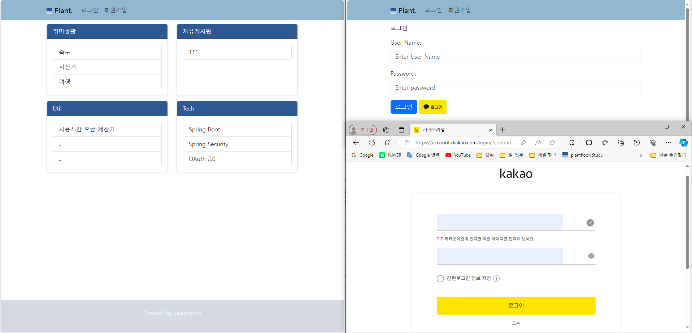

# inteljhn 개인 프로젝트

### 기능 개요
- 게시판 웹사이트
  - 회원가입, 카카오 로그인
  - 본문에 이미지 첨부 가능한 글쓰기

### 기술 스택
- Backend
  - Spring Boot 3.2.1
    - REST API
  - Spring Security 6.2.1
    - OAuth 2.0 (카카오 로그인)
  - Maria DB
  - JPA : Hibernate
  - ~~MyBatis~~
  - logback 로깅
  - Quartz 스케줄러

- Frontend
  - Bootstrap 5
  - Summernote

### 개발 환경 및 빌드, Tools
- Open JDK 21
- STS
- Maven
- DBeaver
- Postman
- Source Tree

### TODO
- 이용시간 요금 계산기 개발
- 구글, 네이버 로그인. jwt.
- 2단계 계층형 댓글
- Apache Netty TCP GW 서버 구성
- RabbitMQ 또는 Apache Kafka 서버 구성
- GW - MQ - WAS 구성의 API 서버 구현
- 리눅스 서버 구성
- 각 레이어별 고가용성을 고려한 구성
- 도메인 구입, SSL 인증서, 호스팅 등의 오픈 전략 수립
- NOSQL 서버 구성. 제품 검토.
